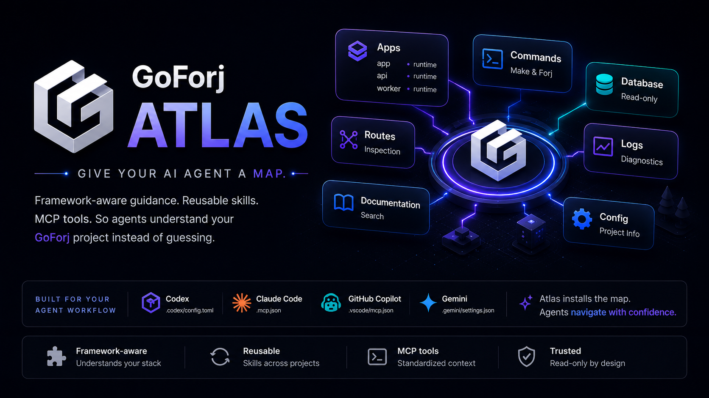

# GoForj Atlas

<p align="center">
  
</p>

Agent-native project navigation and MCP tooling for GoForj.

Atlas helps local coding agents understand GoForj projects without guessing
framework conventions. It installs concise project guidance, synchronizes
skills or agent-native instruction files, configures one project-level MCP
server, and exposes safe read-only project inspection tools.

Users should normally reach Atlas through the GoForj CLI:

```bash
forj atlas:install
forj atlas:mcp
```

This repository owns the reusable implementation. The `goforj/goforj` CLI owns
the user-facing `forj atlas:*` commands and adapts GoForj project config into
Atlas project facts.

## Boundaries

Atlas owns:

- agent adapters
- guideline and skill writers
- docs indexing and section-aware retrieval
- MCP server tooling
- read-only project inspection

Atlas does not own:

- GoForj rendering
- source scaffolding mutations
- arbitrary shell execution
- write-capable MCP tools in the MVP

When source scaffolding is needed, agents should use normal GoForj commands such
as `forj make:*` and `forj <app> make:*`.

## Development

```bash
GOCACHE=/tmp/gocache GOMODCACHE=/tmp/gomodcache go test ./...
```
